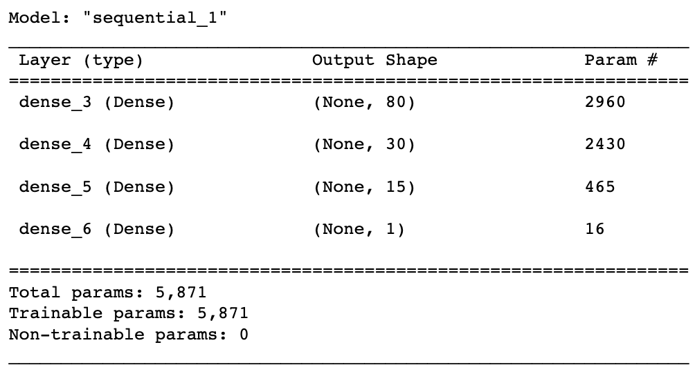

# Neural Network Charity Analysis
## Overview
### Purpose
Our friend Beks, who works for Alphabet Soup, has been tasked with helping create a model to predict whether or not an organization the company provides funding for will be successful. Using my knowledge of machine learning and neural networks, I used the features in the provided dataset of 34,000 organizations to create a binary classifier that is capable of predicting whether applicants will be successful if funded by Alphabet Soup. Following the creation of my initial model, I attempted to optimize it to improve upon the 72% accuracy, with 75% being the optimal threshold. Unfortunately, making changes such as omitting noisy variables, increasing the number of neurons/layers, and changing the activation functions all came up short in increasing the accuracy of the model. 

## Results
### Data Preprocessing
Target Variables:
- IS_SUCCESSFUL column = designates a binary value of whether or not an organization was successful with a provided loan

Features:

- APPLICATION_TYPE = Alphabet Soup application type
- AFFILIATION = Affiliated sector of industry
- CLASSIFICATION = Government organization classification
- USE_CASE = Use case for funding
- ORGANIZATION = Organization type
- STATUS = Active status
- INCOME_AMT = Income classification
- SPECIAL_CONSIDERATIONS = Special consideration for application
- ASK_AMT = Funding amount requested

Removable Variables:
- EIN and NAME = Identification columns

### Compiling, Training, and Evaluating the Model
Original model parameters

- 110 total neurons, 80 in our first hidden layer and 30 in our second
- 3 layers, 2 hidden and 1 output layer
- ReLu and Sigmoid activation functions
- I chose 80 neurons in our first layer due to the vast amount of data (34,000 organizations data points) and 30 neurons in the second layer as it was a little less than half of the first layer neurons. I chose the ReLu function due to the complex data types and the Sigmoid function in my output layer given the model's binary classification outcome.

Unfortunately, I was not able to achieve the target model performance of 75% with the original parameters. In an attempt to improve the accuracy, I did the following:

### 1st Attempt

- Fist Attempt: I first looked at any noisy variables that could be giving the model trouble. Given the vast discrepancies within the binary STATUS and SPECIAL_CONSIDERATIONS variables, I decided to omit them completely. Next, I binned the smaller datapoints in the AFFILIATION, ORGANIZATION, APPLICATION_TYPE, and CLASSIFICATION columns into "Other" categories to bridge the gap with the values with a larger amount of data. This attempt did not increase the accuracy of the model to the 75% threshold.

### 2nd Attempt

- Second Attempt: I used the same dataset I edited from Attempt 1, but with more neurons in a third hidden layer. This did not increase the accuracy of the model to the 75% threshold.

### 3rd Attempt

- Third Attempt: I used the same dataset I edited from Attempt 1, but with Leaky ReLu activation functions in the two hidden layers instead of the ReLu functions. This did not increase the accuracy of the model to the 75% threshold. 

## Summary
Overall, our model did not achieve the 75% accuracy threshold, even after our attempts at optimization. We ultimately settled around 72-73% accuracy, which while not optimal, is still a relatively good model. 

In an attempt to ultimately achieve the 75% accuracy threshold, I would recommend an investigation into a Random Forest Classifier that is, in essence, a slightly watered down version of the neural network. Given the tabular data and its similar functionality, I believe the Random Forest Classifier would be a comparable model that could give us the opportunity to reach the 75% threshold.  This Random Forest Classifier would use a number decision trees to generate a classified output. We could then compare the performance of this model to our neural network. 
